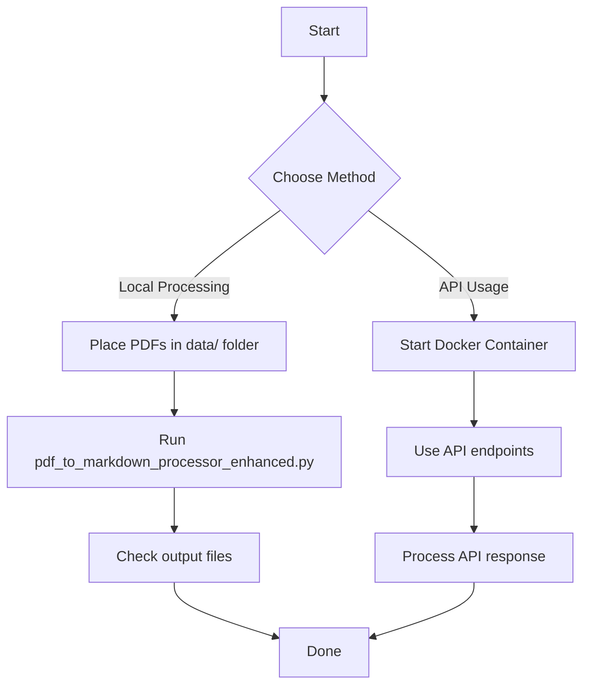

# DeepSeek-OCR2: Dockerized PDF to Markdown API

A powerful OCR solution that converts PDF documents to Markdown format using **DeepSeek-OCR2** with a FastAPI backend. This project provides a production-ready Dockerized environment for high-performance OCR using vLLM.

## 🚀 Quick Start

### 1. Download Model Weights

Create a directory for model weights and download the DeepSeek-OCR2 model:

```bash
# Create models directory
mkdir -p models/deepseek-ai/

# Download using Hugging Face CLI
pip install huggingface_hub
huggingface-cli download deepseek-ai/DeepSeek-OCR2 --local-dir models/deepseek-ai/DeepSeek-OCR2

# IMPORTANT: Remove .git folder inside models to save space (approx 6GB)
rm -rf models/deepseek-ai/DeepSeek-OCR2/.git
```

### 2. Build and Run the Docker Container

The model weights are baked into the image for portability.

#### Build for AMD64 (Standard GPU Servers)

```bash
docker buildx build --platform linux/amd64 -t shrey2003/deepseek-ocr2-dockerized:latest --load .
```

#### Start the service

```bash
docker-compose up -d
```

### 3. Verify Installation

```bash
curl http://localhost:8000/health
```

---

## 📋 Prerequisites

### Hardware Requirements
- **NVIDIA GPU** with CUDA 11.8+ support
- **GPU Memory**: Minimum 16GB VRAM (DeepSeek-OCR2 requires more memory than v1)
- **System RAM**: Minimum 32GB (recommended: 64GB+)
- **Storage**: 60GB+ free space for model and containers

---

## 🔌 REST API Usage

### API Endpoints

#### Process PDF
```bash
curl -X POST "http://localhost:8000/ocr/pdf" \
  -H "Content-Type: multipart/form-data" \
  -F "file=@your_document.pdf"
```

#### Process Image
```bash
curl -X POST "http://localhost:8000/ocr/image" \
  -H "Content-Type: multipart/form-data" \
  -F "file=@your_image.jpg"
```

#### Custom Prompt
```bash
curl -X POST "http://localhost:8000/ocr/pdf" \
  -F "file=@your_document.pdf" \
  -F "prompt=<image>\nExtract all tables and format as CSV."
```

---

## ⚙️ Configuration & Patches

### Custom Patches for DeepSeek-OCR2

This project includes critical patches to make DeepSeek-OCR2 work reliably with modern vLLM and FastAPI. These are automatically applied during the Docker build.

### 1. Model Architecture & Registration
*   **DeepSeek-OCR2 Integration**: Migrated the backend from the v1 architecture to the new `DeepseekOCR2ForCausalLM` architecture.
*   **vLLM Model Registry**: Manually registered the `DeepSeek-OCR2` class in start_server.py using `ModelRegistry.register_model`, ensuring the vLLM engine recognizes the new model's visual causal flow.

### 2. Resolution & Vision Patch (Critical)
*   **768px Force**: DeepSeek-OCR2 is optimized for exactly **768x768** image inputs. The original code often defaulted to 640px, causing "UnboundLocalError" or vision token mismatches. We updated custom_config.py and the processor to strictly enforce 768px.
*   **Processor Patch**: Created custom_image_process_ocr2.py to fix a bug in the vendor's library where `tokenize_with_images()` did not accept a custom `prompt` argument. This patch is automatically injected into the container during the build.

### 3. Docker Optimization
*   **Weights Embedding**: Transitioned from using Docker volumes to **embedding the model weights** directly into the image (`COPY models/ /app/models/`). This makes the image fully portable and "plug-and-play."
*   **Size Reduction**: Optimized the image size by fixing .dockerignore and providing instructions to strip the **6.3GB .git folder** from the model weights before building.
*   **Architecture Locking**: Configured the build to target `linux/amd64`, ensuring compatibility with NVIDIA GPU servers

### 4. Code & Configuration Fixes
*   **Path Correction**: Fixed a bug where `MODEL_PATH` was defaulting to a Hugging Face repo ID (causing 401 errors); it now defaults to the absolute internal path `/app/models/deepseek-ai/DeepSeek-OCR2`.
*   **FastAPI Endpoints**: Updated start_server.py to handle OCR2-specific processor initialization, allowing for dynamic prompt passing (e.g., swapping between "Markdown conversion" and "Plain OCR") via the API.


### Environment Variables

Edit `docker-compose.yml` to adjust these settings:
- `MODEL_PATH`: Path to the model weights inside the container.
- `GPU_MEMORY_UTILIZATION`: Fraction of GPU memory to allocate (default: 0.90).

---

## 🏗️ Project Structure

```
.
├── README.md                              # This file
├── custom_config.py                       # Patched config (768px resolution)
├── custom_image_process_ocr2.py           # Patched vision processor
├── start_server.py                        # FastAPI / vLLM Server
├── Dockerfile                             # AMD64 optimized Dockerfile
├── docker-compose.yml                     # Deployment config
├── pdf_to_markdown_processor_enhanced.py  # Enhanced local processing script
└── models/                                # Directory for model weights
```

---

## 🤝 Support & Repo

Maintained at: [shrey2003/DeepSeek-OCR-2-Dockerized](https://github.com/shrey2003/DeepSeek-OCR-2-Dockerized)
Based on the original [DeepSeek-OCR2](https://github.com/deepseek-ai/DeepSeek-OCR2) library.
We would like to thank [Bogdanovich77/DeekSeek-OCR---Dockerized-API](https://github.com/Bogdanovich77/DeekSeek-OCR---Dockerized-API) for their previous work on DeepSeek OCR which we have further build our work on

---

## 📝 License

This project follows the same license as the DeepSeek-OCR2 project. Please refer to the official DeepSeek-OCR2 repository for licensing details.

---

## 🔄 Usage Workflow


